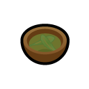

# Many Medicines

[%5D&style=for-the-badge&label=Built%20for%20RimWorld)](https://rimworldgame.com/)
&emsp;

&emsp;

&emsp;

Many Medicines is a [mod](https://rimworldwiki.com/wiki/Mods) for the [Ludeon Studios](https://ludeon.com/) game [RimWorld](https://rimworldgame.com/). Please see the [Acknowledgments section](#acknowledgments) below for important information.

---

## New Drugs

Many Medicines adds a number of new [medical drugs](https://rimworldwiki.com/wiki/Medical_drugs). Some are treatments for acute conditions like disease, infection or trauma; others are best used for the ongoing management of chronic conditions or personality problems. There are neolithic drugs that are available at (or close to, depending on one's mods) the start of a new game, and there are industrial drugs that have research requirements and that are more expensive to produce. Beyond that lie the spacer drugs, remarkably expensive to manufacture but potentially life-changing.

### Neolithic Drugs

These drugs are available from the start of the game with no research required, and can be crafted at either a campfire or a crafting spot with no minimum skills.

#### Chicken Soup

<table>
  <tr>
    <td align="center">
      
    </td>
    <td>This simple broth of meat, vegetables and medicinal herbs makes one feel better when one is sick. It starts spoiling almost immediately, though, so it's best consumed while it's very fresh. For reasons lost to history, this broth is universally called "chicken soup" even though it can be made from almost any ingredients.</td>
  </tr>
    <th>Tech Level</th>
    <td>neolithic</td>
  </tr>
  <tr>
    <th>Research</th>
    <td>—</td>
  </tr>
  <tr>
    <th>Made at</th>
    <td>campfire or stove</td>
  </tr>
  <tr>
    <th>Ingredients</th>
    <td>5 raw meat, 5 raw plant food, 1 herbal medicine</td>
  </tr>
  <tr>
    <th>Yield</th>
    <td>1 chicken soup</td>
  </tr>
  <tr>
    <th>Effects</th>
    <td>blood filtration +20%</td>
  </tr>
  <tr>
    <th>Duration</th>
    <td>about 24 hours</td>
  </tr>
</table>

#### Rose Petal Tea

<table>
  <tr>
    <td align="center">
      
    </td>
    <td>This tea made from rose petals and medicinal herbs relieves stress, promotes good circulation and speeds healing. Its effects are quite mild, but it's free from harmful side effects so it can be consumed frequently without risk of damage or dependence.</td>
  </tr>
  <tr>
    <th>Tech Level</th>
    <td>neolithic</td>
  </tr>
  <tr>
    <th>Research</th>
    <td>—</td>
  </tr>
  <tr>
    <th>Made at</th>
    <td>campfire or stove</td>
  </tr>
  <tr>
    <th>Ingredients</th>
    <td>10 rose petals, 1 herbal medicine</td>
  </tr>
  <tr>
    <th>Yield</th>
    <td>1 rose petal tea</td>
  </tr>
  <tr>
    <th>Effects</th>
    <td>mental break threshold −20%, blood pumping +6%, injury healing factor +8%</td>
  </tr>
  <tr>
    <th>Duration</th>
    <td>about 18 hours</td>
  </tr>
</table>

#### Daylily Root Tea

<table>
  <tr>
    <td align="center">
      
    </td>
    <td>Tea made from daylily roots has antiemetic properties and can provide some relief from food poisoning, gut worms and other gastrointestinal maladies. Over-consumption causes severe rebound nausea.</td>
  </tr>
  <tr>
    <th>Tech Level</th>
    <td>neolithic</td>
  </tr>
  <tr>
    <th>Research</th>
    <td>—</td>
  </tr>
  <tr>
    <th>Made at</th>
    <td>campfire or stove</td>
  </tr>
  <tr>
    <th>Ingredients</th>
    <td>3 daylily roots</td>
  </tr>
  <tr>
    <th>Yield</th>
    <td>1 daylily root tea</td>
  </tr>
  <tr>
    <th>Effects</th>
    <td>prevents vomiting</td>
  </tr>
  <tr>
    <th>Duration</th>
    <td>about 12 hours</td>
  </tr>
</table>

#### Dandelion Leaf Tea

<table>
  <tr>
    <td align="center">
      
    </td>
    <td>This tea made from medicinal herbs and dandelion leaves helps to detoxify the body, as well as stimulating the appetite and settling the stomach. Drinking too much can cause grogginess and nausea, and has a chance of permanently damaging the kidneys. Take no more often than every six hours.</td>
  </tr>
  <tr>
    <th>Tech Level</th>
    <td>neolithic</td>
  </tr>
  <tr>
    <th>Research</th>
    <td>—</td>
  </tr>
  <tr>
    <th>Made at</th>
    <td>campfire or stove</td>
  </tr>
  <tr>
    <th>Ingredients</th>
    <td>4 dandelion leaves, 1 herbal medicine</td>
  </tr>
  <tr>
    <th>Yield</th>
    <td>1 dandelion leaf tea</td>
  </tr>
  <tr>
    <th>Effects</th>
    <td>reduces toxic buildup by an additional 0.24 per day, hunger gain rate +30%, prevents vomiting</td>
  </tr>
  <tr>
    <th>Duration</th>
    <td>about 6 hours</td>
  </tr>
</table>

### Industrial Drugs

These drugs are more difficult and expensive to manufacture, but they're much more effective than the neolithic medicines.

#### Proxen

<table>
  <tr>
    <td align="center">
      
    </td>
    <td>Proxen is a mild analgesic. Non-additive and non-tolerance-forming, but provides only partial relief from pain. Take every 6 hours for best results. Avoid taking more than 4 doses in a 24-hour period.</td>
  </tr>
  <tr>
    <th>Tech Level</th>
    <td>industrial</td>
  </tr>
  <tr>
    <th>Research</th>
    <td>Drug Production → Proxen Production</td>
  </tr>
  <tr>
    <th>Made at</th>
    <td>drug lab</td>
  </tr>
  <tr>
    <th>Ingredients</th>
    <td>1 neutroamine</td>
  </tr>
  <tr>
    <th>Yield</th>
    <td>4 proxen</td>
  </tr>
  <tr>
    <th>Effects</th>
    <td>pain -50%</td>
  </tr>
  <tr>
    <th>Duration</th>
    <td>about 6 hours</td>
  </tr>
  <tr>
    <th>Overdose</th>
    <td>pain, vomiting, chance of liver damage</td>
  </tr>
</table>

#### Mycin

<table>
  <tr>
    <td align="center">
      
    </td>
    <td>Mycin is a synthetic broad-spectrum antimicrobial that boosts the body's natural immune response to bacterial, viral, parasitic and fungal infections. Can be administered responsively to treat infections, or prophylactically to prevent infections. Take daily for best results.</td>
  </tr>
  <tr>
    <th>Tech Level</th>
    <td>industrial</td>
  </tr>
  <tr>
    <th>Research</th>
    <td>Drug Production → Mycin Production</td>
  </tr>
  <tr>
    <th>Made at</th>
    <td>drug lab</td>
  </tr>
  <tr>
    <th>Ingredients</th>
    <td>1 neutroamine, 2 herbal medicine</td>
  </tr>
  <tr>
    <th>Yield</th>
    <td>3 mycin</td>
  </tr>
  <tr>
    <th>Effects</th>
    <td>immunity gain speed +24%, prevents wound infections</td>
  </tr>
  <tr>
    <th>Duration</th>
    <td>about 24 hours</td>
  </tr>
</table>

#### Lopram

<table>
  <tr>
    <td align="center">
      
    </td>
    <td>Lopram is a synthetic antidepressant. When taken daily it significantly improves mood, but developing a dependence on the drug is almost inevitable. Withdrawal symptoms include aches and pains, nausea, irritability, sleeplessness and depression lasting three to four days after the last dose taken. It is best to start a course of treatment with lopram only when a steady supply of the drug can be guaranteed.</td>
  </tr>
  <tr>
    <th>Tech Level</th>
    <td>industrial</td>
  </tr>
  <tr>
    <th>Research</th>
    <td>Drug Production → Lopram Production</td>
  </tr>
  <tr>
    <th>Made at</th>
    <td>drug lab</td>
  </tr>
  <tr>
    <th>Ingredients</th>
    <td>1 neutroamine</td>
  </tr>
  <tr>
    <th>Yield</th>
    <td>2 lopram</td>
  </tr>
  <tr>
    <th>Effects</th>
    <td>mood +12, hunger gain rate +20%, rest fall rate +20%</td>
  </tr>
  <tr>
    <th>Duration</th>
    <td>about 24 hours</td>
  </tr>
</table>

#### Quel

<table>
  <tr>
    <td align="center">
      
    </td>
    <td>Quel is a synthetic antipsychotic that drastically reduces the likelihood of mental breaks. Side effects include drowsiness and increased appetite. It is not recommended for daily use due to tolerance and eventual dependence.</td>
  </tr>
  <tr>
    <th>Tech Level</th>
    <td>industrial</td>
  </tr>
  <tr>
    <th>Research</th>
    <td>Drug Production → Quel Production</td>
  </tr>
  <tr>
    <th>Made at</th>
    <td>drug lab</td>
  </tr>
  <tr>
    <th>Ingredients</th>
    <td>1 neutroamine</td>
  </tr>
  <tr>
    <th>Yield</th>
    <td>2 quel</td>
  </tr>
  <tr>
    <th>Effects</th>
    <td>mental break threshold −40%, rest fall rate +20%, hunger gain rate +40%</td>
  </tr>
  <tr>
    <th>Duration</th>
    <td>about 24 hours</td>
  </tr>
</table>

### Spacer Drugs

These drugs require still more research and more resources to manufacture, but their effects are remarkable.

#### Coagulase

<table>
  <tr>
    <td align="center">
      
    </td>
    <td>Coagulase is a powerful intravenous coagulant that temporarily stops all bleeding. Unfortunately clots have a tendency to form in places like the coronary arteries and the brain, so the risks of life-threatening complication are significant. Coagulase should only be used in medical emergencies.</td>
  </tr>
  <tr>
    <th>Tech Level</th>
    <td>spacer</td>
  </tr>
  <tr>
    <th>Research</th>
    <td>Drug Production → Coagulase Production</td>
  </tr>
  <tr>
    <th>Made at</th>
    <td>drug lab</td>
  </tr>
  <tr>
    <th>Ingredients</th>
    <td>Without Biotech: 4 neutroamine, 1 industrial medicine With Biotech: 3 neutroamine, 1 hemogen pack</td>
  </tr>
  <tr>
    <th>Yield</th>
    <td>1 coagulase</td>
  </tr>
  <tr>
    <th>Effects</th>
    <td>immediately stops all bleeding</td>
  </tr>
  <tr>
    <th>Duration</th>
    <td>about 2 hours</td>
  </tr>
  <tr>
    <th>Complications</th>
    <td>heart attack, ischemic stroke</td>
  </tr>
</table>

---

# FAQ

### Can I add this mod to a save game?

Yes. No problem.

### Can I remove this mod from a save game?

I wouldn't advise it, as a general rule. If you really want to, start by backing up your saves, then get rid of all the mod-added items in your game and make sure none of your pawns are under the influence of any of this mod's hediffs. Then you can try removing the mod. But I can't promise to help you if this breaks your save. That's what the backup is for.

### CE?

No idea. I don't play with [Combat Extended](https://steamcommunity.com/workshop/filedetails/?id=2890901044). I'd love for somebody to try it out and tell me.

### Can I use this with [some other mod]?

Probably. It's extremely unlikely for there to be any conflict between Many Medicines and any other mod (unless another modder decided to use the abbreviation "MMeds"). I've tested this mod with a rather large mod list and had no problems, so you probably won't either. If you do run into an incompatibility of any kind, though, feel free to [open an issue](https://github.com/CaptainArbitrary/ManyMedicines/issues/new) about it.

---

# Acknowledgments

Portions of the materials used to create this mod are trademarks and/or copyrighted works of Ludeon Studios Inc. All rights reserved by Ludeon. This content/mod is not official and is not endorsed by Ludeon.
