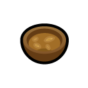

# Many Medicines

&emsp;

&emsp;

&emsp;

Many Medicines is a [mod](https://rimworldwiki.com/wiki/Mods) for the [Ludeon Studios](https://ludeon.com/) game [Rimworld](https://rimworldgame.com/). It adds several new [medical drugs](https://rimworldwiki.com/wiki/Medical_drugs) that players can use to treat acute diseases, manage chronic conditions, or save lives.

This mod is made for Rimworld 1.4. DLCs are supported but not required.

| :exclamation: | Many Medicines is currently under active development. A release to Steam Workshop is planned in the near-ish future, but remember that it'll be ready when it's ready. |
|-|-|

These are the new medical drugs added by the mod.

## Neolithic Drugs

These drugs are available from the start of the game with no research required, and can be crafted at either a campfire or a crafting spot with no minimum skills.

### Chicken Soup

This simple broth of meat, vegetables and medicinal herbs makes one feel better when one is sick. It starts spoiling almost immediately, though, so best consume it while it's very fresh. For reasons lost to history, this broth is universally called "chicken soup" even though it can be made from almost any ingredients.

### Rose Petal Tea

This tea made from rose petals and medicinal herbs relieves stress, promotes good circulation and speeds healing. Its effects are quite mild, but it's free from harmful side effects so it can be consumed frequently without risk of damage or dependence.

### Daylily Root Tea

Tea made from daylily roots has antiemetic properties and can provide some relief from food poisoning, gut worms and other gastrointestinal maladies.

### Dandelion Leaf Tea

This tea made from medicinal herbs and dandelion leaves helps to detoxify the body, as well as stimulating the appetite and settling the stomach. Drinking too much can cause grogginess and nausea, and has a chance of permanently damaging the kidneys. Take no more often than every six hours.

## Industrial Drugs

These drugs have their own research projects, all of which have Drug Production as a prerequisite. They're more difficult and more expensive to manufacture, but they're much more effective than the neolithic medicines.

### Proxen

Proxen is a mild analgesic. Non-additive and non-tolerance-forming, but only really useful for providing partial relief from pain. Effects peak about one hour after administration, then gradually taper off over the next 11 hours. Take two to three times a day for best results.

### Mycin

Mycin is a synthetic broad-spectrum antimicrobial that boosts the body's natural immune response to bacterial, viral, parasitic and fungal infections. Can be administered responsively to treat infections, or prophylactically to prevent infections. Take daily for best results.

### Lopram

Lopram is a synthetic antidepressant. When taken daily it significantly improves mood, but developing a dependence on the drug is extremely likely. Withdrawal symptoms include aches and pains, nausea, irritability, sleeplessness and depression lasting three to four days after the last dose taken. It is best to start a course of treatment with lopram only when a steady supply of the drug can be guaranteed.

### Coagulase

Coagulase is a powerful intravenous coagulant that when administered temporarily stops all bleeding. It can be self-administered, or given to a person who requires aid. Effects last for about two hours. Potentially life-threatening complications include heart attack and ischemic stroke.

## Licensing

Portions of the materials used to create this mod are trademarks and/or copyrighted works of Ludeon Studios Inc. All rights reserved by Ludeon. This content/mod is not official and is not endorsed by Ludeon.
