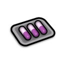
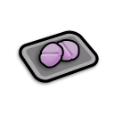
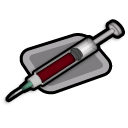

# Many Medicines

[%5D&style=for-the-badge&label=Built%20for%20RimWorld)](https://rimworldgame.com/)
&emsp;

&emsp;

&emsp;

Many Medicines is a [mod](https://rimworldwiki.com/wiki/Mods) for the [Ludeon Studios](https://ludeon.com/) game [RimWorld](https://rimworldgame.com/). Please see the [Acknowledgments section](#acknowledgments) below for important information.

---

## New Drugs

Many Medicines adds several new [medical drugs](https://rimworldwiki.com/wiki/Medical_drugs). Some are treatments for acute conditions like disease, infection or trauma; others are best used for the ongoing management of chronic conditions or personality problems. There are neolithic drugs that are available at (or close to, depending on one's mods) the start of a new game, and there are industrial drugs that have research requirements and that are more expensive to produce.

### Neolithic Drugs

These drugs are available from the start of the game with no research required, and can be crafted at either a campfire or a crafting spot with no minimum skills.

#### Chicken Soup

This simple broth of meat, vegetables and medicinal herbs makes one feel better when one is sick. It starts spoiling almost immediately, though, so it's best consumed while it's very fresh. For reasons lost to history, this broth is universally called "chicken soup" even though it can be made from almost any ingredients.

<table>
  <tr>
    <th>Tech Level</th>
    <td>neolithic</td>
  </tr>
  <tr>
    <th>Research</th>
    <td>—</td>
  </tr>
  <tr>
    <th>Made at</th>
    <td>campfire or stove</td>
  </tr>
  <tr>
    <th>Ingredients</th>
    <td>5 raw meat, 5 raw plant food, 1 herbal medicine</td>
  </tr>
  <tr>
    <th>Yield</th>
    <td>1 chicken soup</td>
  </tr>
  <tr>
    <th>Effects</th>
    <td>blood filtration +20%</td>
  </tr>
  <tr>
    <th>Duration</th>
    <td>about 24 hours</td>
  </tr>
</table>

#### Rose Petal Tea

This tea made from rose petals and medicinal herbs relieves stress, promotes good circulation and speeds healing. Its effects are quite mild, but it's free from harmful side effects so it can be consumed frequently without risk of damage or dependence.

<table>
  <tr>
    <th>Tech Level</th>
    <td>neolithic</td>
  </tr>
  <tr>
    <th>Research</th>
    <td>—</td>
  </tr>
  <tr>
    <th>Made at</th>
    <td>campfire or stove</td>
  </tr>
  <tr>
    <th>Ingredients</th>
    <td>10 rose petals, 1 herbal medicine</td>
  </tr>
  <tr>
    <th>Yield</th>
    <td>1 rose petal tea</td>
  </tr>
  <tr>
    <th>Effects</th>
    <td>mental break threshold −20%, blood pumping +6%, injury healing factor +8%</td>
  </tr>
  <tr>
    <th>Duration</th>
    <td>about 18 hours</td>
  </tr>
</table>

#### Daylily Root Tea

Tea made from daylily roots has antiemetic properties and can provide some relief from food poisoning, gut worms and other gastrointestinal maladies. Over-consumption causes severe rebound nausea.

<table>
  <tr>
    <th>Tech Level</th>
    <td>neolithic</td>
  </tr>
  <tr>
    <th>Research</th>
    <td>—</td>
  </tr>
  <tr>
    <th>Made at</th>
    <td>campfire or stove</td>
  </tr>
  <tr>
    <th>Ingredients</th>
    <td>3 daylily roots</td>
  </tr>
  <tr>
    <th>Yield</th>
    <td>1 daylily root tea</td>
  </tr>
  <tr>
    <th>Effects</th>
    <td>prevents vomiting</td>
  </tr>
  <tr>
    <th>Duration</th>
    <td>about 12 hours</td>
  </tr>
</table>

#### Dandelion Leaf Tea

This tea made from medicinal herbs and dandelion leaves helps to detoxify the body, as well as stimulating the appetite and settling the stomach. Drinking too much can cause grogginess and nausea, and has a chance of permanently damaging the kidneys. Take no more often than every six hours.

Dandelion leaf tea is brewed from four dandelion leaves and one herbal medicine over a campfire or at a stove. It accelerates the rate at which the body clears accumulated toxic buildup by an additional 0.24 severity per day. It also increases the pawn's hunger rate by 30% and prevents vomiting. At higher doses, it increases the pawn's pain by 30%, reduces the pawn's consciousness by 30%, and _causes_ vomiting. At even higher doses overdose occurs, which increases pain by 50%, reduces consciousness by 50% and has a chance of causing minor chemical damage to one or both kidneys (part efficiency -10%).

### Industrial Drugs

These drugs have their own research projects, all of which have Drug Production as a prerequisite. They're more difficult and more expensive to manufacture, but they're much more effective than the neolithic medicines.

#### Proxen

Proxen is a mild analgesic. Non-addictive and non-tolerance-forming, but only really useful for providing partial relief from pain. Effects peak about one hour after administration, then gradually taper off over the next 11 hours. Take two to three times a day for best results.

Research prerequisite: Proxen Production (requires Drug Production). This drug is synthesized at a drug lab out of one neutroamine, yielding four doses of proxen. At peak effectiveness, proxen reduces pain by a flat 50% across the board, tapering off over six hours. Overdosing on proxen _increases_ pain by 80% and reduces consciousness by 80%, usually requiring bed rest. The effects of the overdose are _not_ life-threatening and resolve in about two days.

#### Mycin

Mycin is a synthetic broad-spectrum antimicrobial that boosts the body's natural immune response to bacterial, viral, parasitic and fungal infections. Can be administered responsively to treat infections, or prophylactically to prevent infections. Take daily for best results.

Research prerequisite: Mycin Production (requires Drug Production). Synthesized at a drug lab from one neutroamine and two herbal medicine, yielding three doses. Speeds immunity gain by 24% for about a day; also prevents wound infections, so mycin can be given prophylactically to wounded pawns if desired.

#### Lopram

Lopram is a synthetic antidepressant. When taken daily it significantly improves mood, but developing a dependence on the drug is extremely likely. Withdrawal symptoms include aches and pains, nausea, irritability, sleeplessness and depression lasting three to four days after the last dose taken. It is best to start a course of treatment with lopram only when a steady supply of the drug can be guaranteed.

Research prerequisite: Lopram Production (requires Drug Production). Synthesized at a drug lab; one neutroamine yields two doses of lopram. One dose gives a +12 boost to a pawn's mood for 24 hours. It also increases the hunger rate and the rest fall rate by 20% each. Repeated use of lopram quickly leads to dependence on the drug. Discontinuation adds a mood malus of -35. It also causes occasional vomiting, increases pain by 30%, increases the pawn's chance of starting social fights by a factor of five, and reduces the pawn's rest fall rate by 40%. Withdrawal lasts about four days but is at no point life-threatening.

#### Quel

Quel is a synthetic antipsychotic that drastically reduces the likelihood of mental breaks. Side effects include drowsiness and increased appetite. Quel's beneficial effect lasts for about a day, but it is not recommended for daily use as regular users of the drug develop a tolerance to it that can quickly lead to physical dependence.

Research prerequisite: Quel Production (requires Drug Production). Synthesized at a drug lab from one neutroamine per two doses of quel. A dose of quel reduces a pawn's mental break threshold by 40%, but also reduces consciousness by 10%. It also increases the pawn's rest fall rate by 20% and hunger rate by 40%. Tolerance builds quickly, decreasing the drug's duration of effect sharply. Once addicted, a pawn needs increasingly frequent doses of quel to stave off withdrawal symptoms, which can be severe: pain +10%, hunger +60%, rest need +40%, consciousness ×80% and a dramatic rise in the pawn's mental break threshold. Withdrawal also causes a -12 to mood, making mental breaks that much more likely. However, the dependence on the drug is short-lived, diminishing and finally disappearing over five to 10 days.

#### Coagulase

Coagulase is a powerful intravenous coagulant that when administered temporarily stops all bleeding. It can be self-administered, or given to a person who requires aid. Unfortunately clots have a tendency to form in places like the coronary arteries and the arteries of the brain, so the risks of life-threatening complication are significant. Coagulase should only be used in medical emergencies.

Research prerequisite: Coagulase Production (requires Drug Production). Synthesized at a drug lab from four neutroamine and one industrial medicine. When administered, coagulase immediately stops all bleeding, but has a chance of causing a heart attack or an ischemic stroke. Note that if the Biotech DLC is installed, the recipe for coagulase is three neutroamine and one hemogen pack.

---

# FAQ

### Can I add this mod to a save game?

Yes. No problem.

### Can I remove this mod from a save game?

I wouldn't advise it, as a general rule. If you really want to, start by backing up your saves, then get rid of all the mod-added items in your game and make sure none of your pawns are under the influence of any of this mod's hediffs. Then you can try removing the mod. But I can't promise to help you if this breaks your save. That's what the backup is for.

### CE?

No idea. I don't play with [Combat Extended](https://steamcommunity.com/workshop/filedetails/?id=2890901044). I'd love for somebody to try it out and tell me.

### Can I use this with [some other mod]?

Probably. It's extremely unlikely for there to be any conflict between Many Medicines and any other mod (unless another modder decided to use the abbreviation "MMeds"). I've tested this mod with a rather large mod list and had no problems, so you probably won't either. If you do run into an incompatibility of any kind, though, feel free to [open an issue](https://github.com/CaptainArbitrary/ManyMedicines/issues/new) about it.

---

# Acknowledgments

Portions of the materials used to create this mod are trademarks and/or copyrighted works of Ludeon Studios Inc. All rights reserved by Ludeon. This content/mod is not official and is not endorsed by Ludeon.
